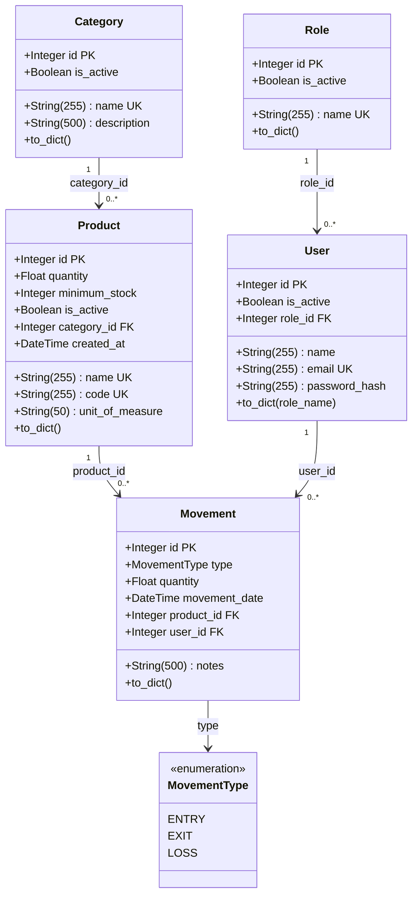

# SCGE — Diagrama de classes (backend / banco de dados)

Baseado nos models SQLAlchemy em `backend/models/` e nas tabelas criadas via `Base.metadata.create_all`.

---

## 1. Diagrama visual (Mermaid)



---

## 2. Diagrama por escrito (UML textual)

```
┌─────────────────────────────────────────────────────────────────────────────┐
│                              <<enumeration>>                               │
│                              MovementType                                   │
├─────────────────────────────────────────────────────────────────────────────┤
│ ENTRY = "entry"                                                             │
│ EXIT  = "exit"                                                              │
│ LOSS  = "loss"                                                              │
└─────────────────────────────────────────────────────────────────────────────┘
                                      ▲
                                      │ usa
                                      │
┌──────────────────────────┐         ┌──────────────────────────────────────────┐
│ Role                     │         │ Movement                                 │
│ tabela: roles            │         │ tabela: stock_movements                  │
├──────────────────────────┤         ├──────────────────────────────────────────┤
│ - id: Integer [PK]       │         │ - id: Integer [PK]                       │
│ - name: String(255) [UK] │         │ - type: Enum(MovementType)               │
│ - is_active: Boolean     │         │ - quantity: Float                        │
├──────────────────────────┤         │ - movement_date: DateTime(tz)            │
│ + to_dict(): dict        │         │ - notes: String(500) [opcional]          │
└────────────┬─────────────┘         │ - product_id: Integer [FK → products]    │
             │                       │ - user_id: Integer [FK → users]          │
             │ 1                     ├──────────────────────────────────────────┤
             │                       │ + to_dict(): dict                        │
             │ possui                └───────────┬──────────────────┬───────────┘
             │ *                               │                  │
             ▼                                   │ N                │ N
┌──────────────────────────┐                   │                  │
│ User                     │◄──────────────────┘                  │
│ tabela: users            │◄─────────────────────────────────────┘
├──────────────────────────┤         registra              pertence a
│ - id: Integer [PK]       │         movimentação          1 produto
│ - name: String(255)      │
│ - email: String(255) [UK]│
│ - password_hash: String  │
│ - is_active: Boolean     │
│ - role_id: Integer [FK]  │──────────► roles.id
├──────────────────────────┤
│ + to_dict(role_name): dict│
└──────────────────────────┘


┌──────────────────────────┐         ┌──────────────────────────┐
│ Category                 │         │ Product                  │
│ tabela: categories       │         │ tabela: products         │
├──────────────────────────┤         ├──────────────────────────┤
│ - id: Integer [PK]       │         │ - id: Integer [PK]       │
│ - name: String(255) [UK] │    1    │ - name: String(255) [UK] │
│ - description: String    │────────►│ - code: String(255) [UK]│
│ - is_active: Boolean     │    *    │ - quantity: Float        │
├──────────────────────────┤         │ - unit_of_measure: String│
│ + to_dict(): dict        │         │ - minimum_stock: Integer │
└──────────────────────────┘         │ - is_active: Boolean     │
                                     │ - category_id: Integer   │──► categories.id
                                     │ - created_at: DateTime     │
                                     ├──────────────────────────┤
                                     │ + to_dict(): dict        │
                                     │   (inclui low_stock)     │
                                     └──────────────────────────┘
```

---

## 3. Mapeamento Model → Tabela → Colunas

| Model (classe Python) | Arquivo | Tabela no banco | Herda de |
|----------------------|---------|-----------------|----------|
| `Role` | `models/role.py` | `roles` | `Base` |
| `User` | `models/user.py` | `users` | `Base` |
| `Category` | `models/category.py` | `categories` | `Base` |
| `Product` | `models/product.py` | `products` | `Base` |
| `Movement` | `models/movement.py` | `stock_movements` | `Base` |
| `MovementType` | `models/movement.py` | *(enum, não é tabela)* | `enum.Enum` |

### Tabela `roles`

| Coluna | Tipo SQLAlchemy | Restrições |
|--------|---------------|------------|
| `id` | Integer | PK, autoincrement |
| `name` | String(255) | NOT NULL, UNIQUE |
| `is_active` | Boolean | NOT NULL, default `True` |

### Tabela `users`

| Coluna | Tipo SQLAlchemy | Restrições |
|--------|---------------|------------|
| `id` | Integer | PK, autoincrement |
| `name` | String(255) | NOT NULL |
| `email` | String(255) | NOT NULL, UNIQUE |
| `password_hash` | String(255) | NOT NULL |
| `is_active` | Boolean | NOT NULL, default `True` |
| `role_id` | Integer | NOT NULL, FK → `roles.id` |

### Tabela `categories`

| Coluna | Tipo SQLAlchemy | Restrições |
|--------|---------------|------------|
| `id` | Integer | PK, autoincrement |
| `name` | String(255) | NOT NULL, UNIQUE |
| `description` | String(500) | NOT NULL |
| `is_active` | Boolean | NOT NULL, default `True` |

### Tabela `products`

| Coluna | Tipo SQLAlchemy | Restrições |
|--------|---------------|------------|
| `id` | Integer | PK, autoincrement |
| `name` | String(255) | NOT NULL, UNIQUE |
| `code` | String(255) | NOT NULL, UNIQUE |
| `quantity` | Float | NOT NULL, default `0` |
| `unit_of_measure` | String(50) | NOT NULL |
| `minimum_stock` | Integer | NOT NULL, default `0` |
| `is_active` | Boolean | NOT NULL, default `True` |
| `category_id` | Integer | NOT NULL, FK → `categories.id` |
| `created_at` | DateTime(timezone=True) | NOT NULL, default UTC now |

### Tabela `stock_movements`

| Coluna | Tipo SQLAlchemy | Restrições |
|--------|---------------|------------|
| `id` | Integer | PK, autoincrement |
| `type` | Enum(`MovementType`) | NOT NULL |
| `quantity` | Float | NOT NULL |
| `movement_date` | DateTime(timezone=True) | NOT NULL, default UTC now |
| `notes` | String(500) | NULL (opcional) |
| `product_id` | Integer | NOT NULL, FK → `products.id` |
| `user_id` | Integer | NOT NULL, FK → `users.id` |

---

## 4. Relacionamentos (cardinalidade)

| De | Para | Cardinalidade | FK | Significado |
|----|------|---------------|-----|-------------|
| `Role` | `User` | 1 : N | `users.role_id` | Um cargo pode ter vários usuários; cada usuário tem um cargo |
| `Category` | `Product` | 1 : N | `products.category_id` | Uma categoria agrupa vários produtos |
| `Product` | `Movement` | 1 : N | `stock_movements.product_id` | Um produto tem várias movimentações |
| `User` | `Movement` | 1 : N | `stock_movements.user_id` | Um usuário registra várias movimentações |

**Regra de negócio implícita:** `Product.quantity` é alterado pelas movimentações (`ENTRY` soma, `EXIT`/`LOSS` subtraem) — não há coluna de estoque em `Movement`, só o delta (`quantity`).

---

## 5. Como montar o diagrama (passo a passo)

1. **Desenhe cada entidade** como uma caixa com o nome da **classe** (`User`) e da **tabela** (`users`).
2. **Liste os atributos** com tipo e marcações: `[PK]`, `[FK]`, `[UK]`, opcional.
3. **Enums** (`MovementType`) ficam separados, ligados ao atributo `type` de `Movement`.
4. **Ligue as entidades** com linhas:
   - lado `1` = entidade “pai” (ex.: `Role`)
   - lado `*` = entidade “filha” (ex.: `User`)
   - anote o nome da FK na ponta filha
5. **Métodos** `to_dict()` são comportamento da aplicação — opcionais no diagrama de banco, úteis no diagrama de classes.
6. **Não há `relationship()`** no código hoje — os joins são manuais nos services; o diagrama reflete só FKs reais no banco.

---

## 6. Diagrama ER simplificado (só banco)

```
roles (1) ──────< (N) users (1) ──────< (N) stock_movements
                                              │
categories (1) ──< (N) products (1) ─────────┘
```

---

## 7. Observações do código atual

- **Soft delete:** `is_active = False` em `User`, `Role`, `Category`, `Product` (não há DELETE físico nos services).
- **Sem tabela para `MovementType`:** valores persistidos como enum na coluna `type`.
- **Banco:** SQLite local (`DATABASE_URL` no `.env`); tabelas criadas no startup em `app.py` via `create_all`.
- **Sem `relationship()` SQLAlchemy:** diagrama lógico usa FKs; ORM não declara navegação objeto-objeto ainda.

---

*Gerado a partir de `backend/models/` — SCGE, 2026.*
